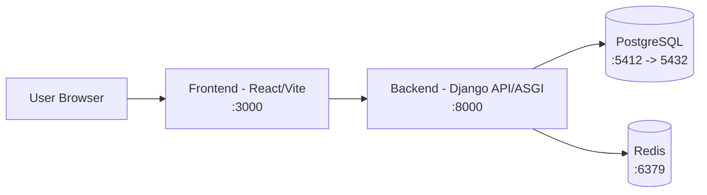

# Vehicle Management System (VMS)

A full-stack Vehicle Management System for managing fleet operations, drivers, branches, and bookings.

## Overview

This project combines:
- **Backend:** Django + Django REST Framework + Channels
- **Frontend:** React (Vite)
- **Database:** PostgreSQL
- **Cache / messaging:** Redis
- **Containerization:** Docker + Docker Compose

The system is designed to support operational workflows such as vehicle assignment, booking management, and dispatch-related processes in a modular architecture.

## Architecture



## Repository Structure

- `backend/`: Django project and apps (`bookings`, `driver`, `fleet`, `branch`, `profile`, `core`)
- `frontend/`: React application powered by Vite
- `docker-compose.yml`: Multi-container local development stack

## Prerequisites

Install the following before running the project:
- **Docker Desktop** (latest stable)
- **Git**

Verify Docker is running:

```bash
docker --version
docker compose version
```

## Download the Project

Clone the repository and enter the project directory:

```bash
git clone https://github.com/Sushovan-kc/Ntc-vms.git
cd Ntc-vms
```

If your local folder name is different, run commands from the folder that contains `docker-compose.yml`.

## Environment Setup

Create an environment file at:
- `backend/.env`

Minimum required values:

```env
SECRET_KEY=change-this-to-a-strong-secret
DEBUG=True
ALLOWED_HOSTS=localhost,127.0.0.1
CSRF_TRUSTED_ORIGINS=http://localhost:3000,http://127.0.0.1:3000
CORS_ALLOWED_ORIGINS=http://localhost:3000,http://127.0.0.1:3000
EMAIL_HOST_USER=your_email@example.com
EMAIL_HOST_PASSWORD=your_email_app_password
FRONTEND_URL=http://localhost:3000
```

Notes:
- `SECRET_KEY` is mandatory for Django startup.
- For local Docker usage, the database and Redis endpoints are already wired via Docker Compose.

## Launch with Docker

From the project root (where `docker-compose.yml` exists):

1. Build and start all services

```bash
docker compose up --build -d
```

2. Run database migrations

```bash
docker compose exec backend python manage.py migrate
```

3. (Optional) Create an admin user

```bash
docker compose exec backend python manage.py createsuperuser
```

4. Access the application
- Frontend: `http://localhost:3000`
- Backend API: `http://localhost:8000`
- Django Admin: `http://localhost:8000/admin`

## Common Docker Commands

View running services:

```bash
docker compose ps
```

View logs:

```bash
docker compose logs -f
```

View backend logs only:

```bash
docker compose logs -f backend
```

Stop services:

```bash
docker compose down
```

Stop services and remove volumes (resets DB data):

```bash
docker compose down -v
```

## Troubleshooting

- If backend fails at startup with missing settings, verify `backend/.env` exists and includes `SECRET_KEY`.
- If frontend cannot reach API, confirm all containers are up using `docker compose ps`.
- If migration errors occur, restart from a clean state:

```bash
docker compose down -v
docker compose up --build -d
docker compose exec backend python manage.py migrate
```

## Tech Stack Summary

- Python 3.12 (Docker image)
- Django 6 + DRF + Channels
- React 19 + Vite
- PostgreSQL 16
- Redis 7
- Docker Compose

## License

Add your preferred license information here (for example: MIT).
